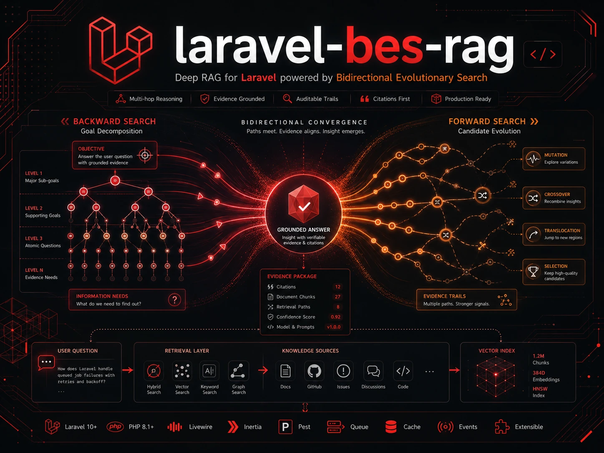

# laravel-bes-rag



**A deep RAG search orchestrator for Laravel**, based on [Bidirectional Evolutionary Search (BES)](https://arxiv.org/abs/2605.28814): instead of `question → top-k → answer`, hard multi-hop questions are decomposed into checkable sub-goals, multiple *evidence trails* are evolved against them, and the final answer is synthesized strictly from cited evidence — with a full audit trail of every query, chunk and score.

Built on the [Laravel AI SDK](https://github.com/laravel/ai) (`laravel/ai`) as the provider-agnostic engine for text generation, structured output and embeddings.

```text
Question
  → backward decomposition: checkable sub-goals with declarative verifiers
  → forward search: seed multiple retrieval/answer trails
  → scoring: evidence coverage, groundedness, citation support, contradictions
  → evolution: expand / combine / delete / translocate / crossover
  → final answer: best grounded terminal trail, synthesized from its evidence only
```

> **When to use this:** BES-RAG is a *deep research mode* for hard, multi-hop questions where plain top-k RAG fails. It costs a multiple of a single RAG call (budgeted and capped, but real). Don't route every query through it.

## Installation

```bash
composer require twdnhfr/laravel-bes-rag

php artisan vendor:publish --tag="bes-rag-migrations"
php artisan migrate

php artisan vendor:publish --tag="bes-rag-config"   # optional
```

## Quick start

The only contract you must provide is the `Retriever` — the adapter to your vector store or search index:

```php
use Twdnhfr\BesRag\Contracts\Retriever;
use Twdnhfr\BesRag\Data\RetrievalQuery;
use Twdnhfr\BesRag\Data\RetrievedChunk;

class PgVectorRetriever implements Retriever
{
    public function retrieve(RetrievalQuery $query, int $topK = 5): array
    {
        // query your store, return RetrievedChunk[]
    }
}
```

Then run a deep search:

```php
use Twdnhfr\BesRag\Facades\BesRag;

$result = BesRag::make()
    ->retriever(new PgVectorRetriever)
    ->budget(30)
    ->maxDepth(3)
    ->answer('Who founded the company that produces the Model S?');

$result->answer();         // cited answer: "... [doc_42/chunk_3]"
$result->citations();      // [['document_id' => 'doc_42', 'chunk_id' => 'chunk_3'], ...]
$result->evidenceTrail();  // the full winning trail for auditing
$result->scores();         // raw / backward / effective + per-goal coverage
```

Multi-tenant stores scope retrieval per run via `->retrievalContext([...])` — the array is persisted with the run (so queue workers see it) and arrives at your retriever as `RetrievalQuery->filters`:

```php
BesRag::make()->retrievalContext(['brain_id' => $brain->id])->dispatch($question);
```

### Async via queue pipeline

```php
// Bind the retriever so queue workers can rebuild the engine:
$this->app->bind(\Twdnhfr\BesRag\Contracts\Retriever::class, PgVectorRetriever::class);

$result = BesRag::make()->dispatch($question);   // returns immediately
$result->id();                                   // poll later:
BesRag::result($id)->finished();
```

The pipeline runs `StartRun → SeedCandidates → SearchStep (self-redispatching) → FinalizeAnswer`. Payloads carry only the run id; all artifacts live in the database.

### HTTP API (opt-in)

Set `BES_RAG_ROUTES_ENABLED=true` (add your own auth middleware via `bes-rag.routes.middleware`):

| Method | Route | Purpose |
|---|---|---|
| POST | `/bes-rag/deep-answer` | start a run (`{question, sync?, budget?}`) |
| GET | `/bes-rag/runs/{run}` | status + answer |
| GET | `/bes-rag/runs/{run}/debug` | goal tree, all candidates, scores, steps |
| GET | `/bes-rag/runs/{run}/stream` | SSE progress events |

## How it works

### Backward decomposition

The question is decomposed (via LLM structured output) into atomic sub-goals with **declarative verifiers** — never LLM-generated code:

| Verifier type | Checks |
|---|---|
| `semantic_query_coverage` | a trail query/chunk is semantically close to the goal (embeddings) |
| `evidence_presence` | ≥ N evidence chunks with source metadata |
| `citation_support` | answer claims are backed by cited chunks (LLM judge) |
| `entity_match` | required entities/dates literally appear in evidence |
| `contradiction_check` | no evidence strongly contradicts the answer (LLM judge) |
| `dependency_satisfied` | gating on `depends_on` goals |

Register your own via `->verifier('my_type', new MyVerifier)`.

### Forward search & evolution

A candidate is an `EvidenceTrail` (queries → retrieved chunks → selected evidence → synthesis notes → answer draft), not just an answer. Parents are selected by Boltzmann sampling over effective scores (temperature annealed across the budget); pair operators pick complementary parents. Default operator mix (configurable):

```
expand 70% · combine 10% · translocate 7.5% · crossover 7.5% · delete 5%
```

`crossover` cuts along goal boundaries, never blindly by step index — source context stays intact.

### Scoring

```text
raw_score      = weighted(groundedness, citation support, evidence quality,
                          contradiction absence, source diversity)
backward_score = recursive goal-tree score (alpha-blend of self + children)
effective      = bucket_interpolation(raw, backward)   ← default
```

The bucket policy makes the *hard* signal dominate: a trail that merely "looks topically right" to the goal tree can never outrank a meaningfully better-grounded trail. Backward score only breaks ties within a raw-score bucket. (`score_policy: weighted` gives the simple linear blend.)

### Cost control

Two independent caps stop a run deterministically: the **step budget** (`budget`) and the **LLM call cap** (`max_llm_calls`) — one search step can trigger several LLM calls, so the step budget alone doesn't bound cost. The LLM judge (groundedness/citations/contradictions) is one memoized structured call per scored trail. Embeddings are cached in-process and optionally in a Laravel cache store.

> **Thresholds are embedder-relative.** `thresholds.semantic_coverage: 0.72` is calibrated for MiniLM-class embeddings. Recalibrate against a small eval set when you switch embedding models.

## Testing your integration

The package ships deterministic fakes (no HTTP):

```php
use Twdnhfr\BesRag\Testing\FakeLlm;
use Twdnhfr\BesRag\Testing\FakeEmbedder;
use Twdnhfr\BesRag\Retrieval\ArrayRetriever;

$llm = (new FakeLlm)
    ->onStructured(fn ($instructions, $prompt) => [...])
    ->onText(fn () => 'Answer with citation [doc/c1].');

$result = BesRag::make()
    ->retriever(new ArrayRetriever([...chunks...]))
    ->llm($llm)
    ->embedder(new FakeEmbedder)
    ->answer('...');
```

## Configuration

See [`config/bes-rag.php`](config/bes-rag.php) — provider/models per purpose (decompose/expand/verify/synthesize/embeddings), budgets, operator mix, scoring weights, thresholds, queue and routes. Everything is also overridable per run through the fluent builder.

## What this deliberately does not do

- **No dynamic code eval.** The original BES inference code verifies goals with Python `eval`; this package uses registered, declarative verifiers only.
- **No blind step concatenation.** Evolution operators cut along goal boundaries to preserve source context.
- **No backward-score dominance.** Groundedness and citation support always outrank topical coverage.

## Credits & paper

Independent Laravel implementation of the search method from:

> Xu, Qi, Su, Ye, Lakkaraju, Kakade, Du — *Self-Improving Language Models with Bidirectional Evolutionary Search* ([arXiv:2605.28814](https://arxiv.org/abs/2605.28814), [project page](https://guoweixu.com/bes/), [code](https://github.com/Embodied-Minds-Lab/BES))

No shared code or affiliation; the multi-hop adaptation follows the paper's appendix.

## License

MIT — see [LICENSE.md](LICENSE.md).
